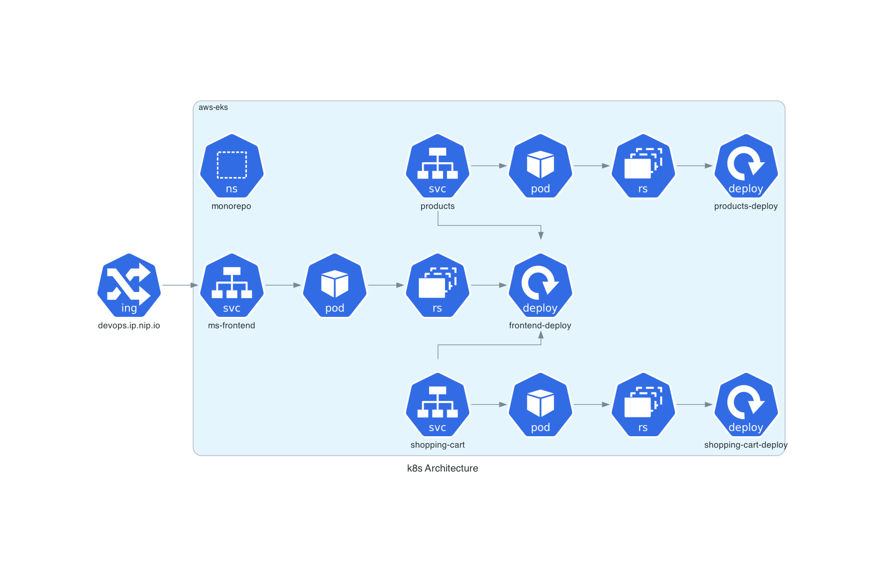
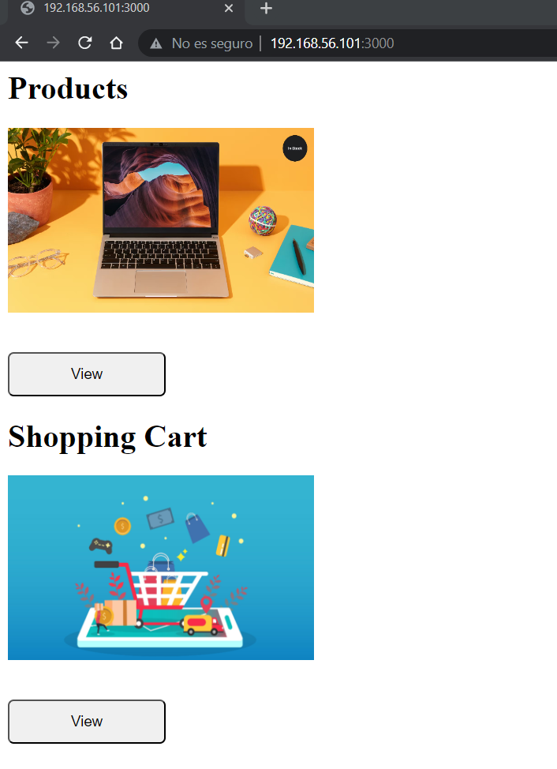
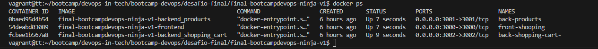
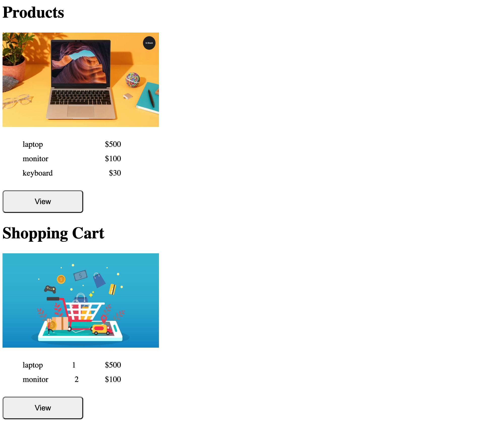

### CHALLENGE FINAL Bootcamp DevOps V1

La empresa ZERO Technology, solicita al Equipo de DevOps Trainer, la contenerizacion de su aplicacion "Products DevOps" en la que incluye:

- Frontend
- Backend: products & shopping-cart

#### Frontend
Aplicacion realizada en express y se expone en el puerto 3000

### Backend products
Aplicacion realizada en express y se expone en el puerto 3001

### Backend shopping-cart
Aplicacion realizada en express y se expone en el puerto 3002

### Arquitectura



<!-- #### Build Docker 
- Para construir ejecutamos lo siguiente:
```
    docker build -t ms-frontend:1.0 frontend
    docker build -t ms-products:1.0 products
    docker build -t ms-shopping-cart:1.0 shopping-cart
```
#### Prueba Local
    cd micro-service-name 
    npm install
    npm run
    

#### Iniciar los contenedores 
    docker run -d -p 3000:3000 \
    -e PRODUCTS_SERVICE=host.docker.internal \
    -e SHOPPING_CART_SERVICE=host.docker.internal \
    ms-frontend:1.0

    docker run -d -p 3001:3001 ms-products:1.0
    docker run -d -p 3002:3002 ms-shopping-cart:1.0

### Adicional 
- Crear Documentación
- Buenas practicas -->

## Resultado



<!--  -->
